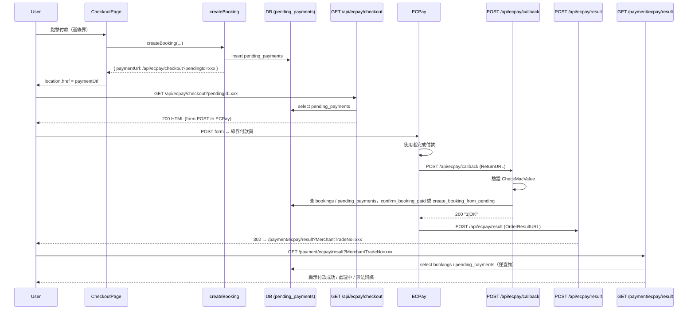
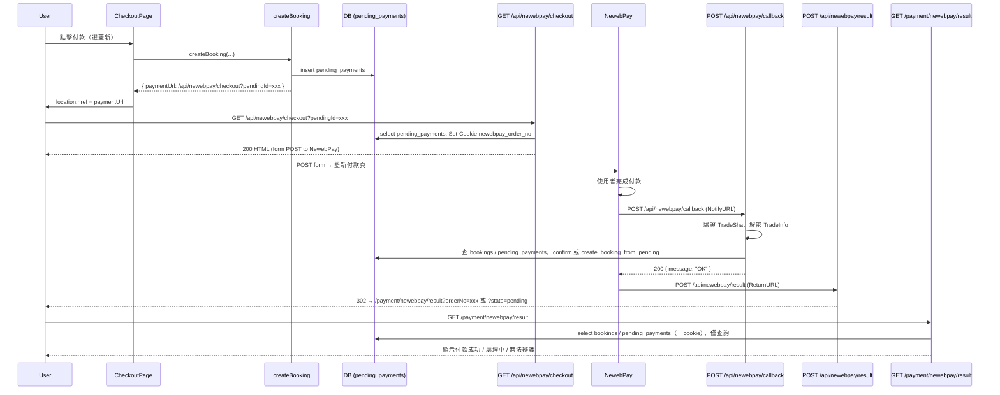
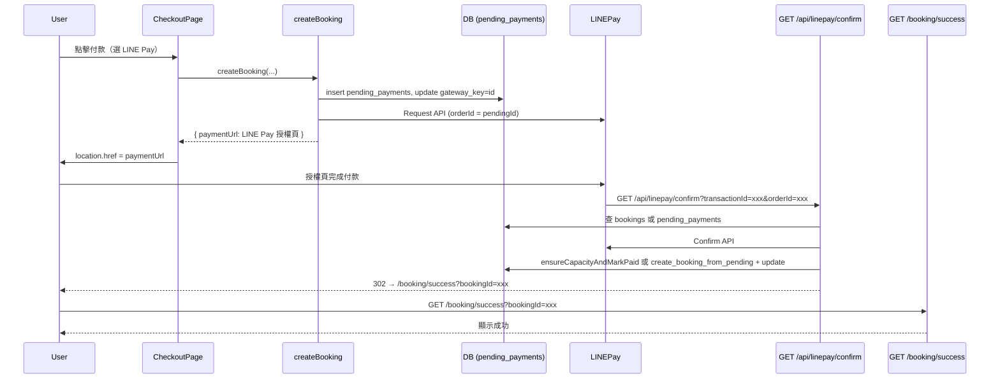

# 支付流程與安全檢查報告

本報告依專案掃描整理：**不修改任何程式碼**，僅產出結構化說明。

---

# 一、各金流完整流程

## 1️⃣ ECPay（綠界）

| 步驟 | 說明 |
|------|------|
| 使用者點擊付款 | 結帳頁選綠界 → 送出表單觸發 Server Action `createBooking` |
| 建立 pending | `createBooking` 內呼叫 `createPendingPayment` → 寫入 `pending_payments`（gateway_key = EC 開頭 20 字） |
| 回傳 paymentUrl | `paymentUrl = ${appUrl}/api/ecpay/checkout?pendingId=xxx`，前端 `window.location.href = paymentUrl` |
| Checkout route | **GET** `/api/ecpay/checkout?pendingId=xxx`：讀 pending，組綠界參數，回傳 HTML 表單自動 POST 到綠界 |
| Redirect 金流 | 瀏覽器送出表單 → 綠界付款頁（ReturnURL=`/api/ecpay/callback`，OrderResultURL=`/api/ecpay/result`） |
| Callback route | **POST** `/api/ecpay/callback`：驗 CheckMacValue → RtnCode=1 → 查 booking 或 pending → 有 booking 且 unpaid 則 `ensureCapacityAndMarkPaid`，否則 `create_booking_from_pending` + update ecpay 欄位 → 回 `1|OK` |
| Result route | **POST** `/api/ecpay/result`：解析 MerchantTradeNo → **302** 到 `/payment/ecpay/result?MerchantTradeNo=xxx`（不寫 DB） |
| 結果頁 | **GET** `/payment/ecpay/result`：依 MerchantTradeNo 查 bookings / pending_payments，**僅顯示** paid / unpaid / not_found |
| Booking status | 僅在 **callback** 更新：unpaid → paid（RPC `confirm_booking_paid`）或 pending → 新建一筆 paid booking（RPC `create_booking_from_pending`） |

---

## 2️⃣ NewebPay（藍新）

| 步驟 | 說明 |
|------|------|
| 使用者點擊付款 | 結帳頁選藍新 → `createBooking` |
| 建立 pending | `createPendingPayment` → `pending_payments`（gateway_key = NB+timestamp） |
| 回傳 paymentUrl | `paymentUrl = ${appUrl}/api/newebpay/checkout?pendingId=xxx` |
| Checkout route | **GET** `/api/newebpay/checkout?pendingId=xxx`：讀 pending，組藍新參數，Set-Cookie `newebpay_order_no`，回傳 HTML 表單 POST 到藍新 |
| Redirect 金流 | 藍新付款頁（returnURL=`/api/newebpay/result`，notifyURL=`/api/newebpay/callback`） |
| Callback route | **POST** `/api/newebpay/callback`（NotifyURL）：驗 TradeSha → 解密 TradeInfo → 判成功 → 查 booking 或 pending → 有 booking 且 unpaid 則 `ensureCapacityAndMarkPaid`，否則 `create_booking_from_pending` + update newebpay 欄位 → 回 200 OK |
| Result route | **POST** `/api/newebpay/result`：取 MerchantOrderNo（plain 或解密）→ **302** 到 `/payment/newebpay/result?orderNo=xxx` 或 `?state=pending`（不寫 DB） |
| 結果頁 | **GET** `/payment/newebpay/result`：可帶 orderNo / state=pending / cookie，查 bookings / pending_payments，**僅顯示** |
| Booking status | 僅在 **callback** 更新：同上（unpaid → paid 或 pending → 新建 paid） |

**額外 route**（非主流程）：
- **GET/POST** `/api/newebpay/back`：ClientBackURL，僅 302 到 `/member`，不寫 DB。
- **POST** `/api/newebpay/callback/return`：另一 ReturnURL 實作，驗 TradeSha、解密後依 MerchantOrderNo 查 booking，302 到 `/booking/success?bookingId=xxx` 或結果頁；**不寫 DB**，僅導向。

---

## 3️⃣ LINE Pay

| 步驟 | 說明 |
|------|------|
| 使用者點擊付款 | 結帳頁選 LINE Pay → `createBooking` |
| 建立 pending | `createPendingPayment` → `pending_payments`，再 update `gateway_key = pendingId`（orderId 用 pending id） |
| 回傳 paymentUrl | LINE Pay Request API 回傳 `paymentUrl.web`，前端直接 `location.href = paymentUrl` |
| 無 checkout route | 不經過本站 checkout API，直接導向 LINE Pay 授權頁 |
| Redirect 金流 | LINE 導回 **GET** `/api/linepay/confirm?transactionId=xxx&orderId=xxx`（orderId = pending id） |
| Confirm route | **GET** `/api/linepay/confirm`：以 orderId 先查 bookings（id=orderId）；若無或非 unpaid linepay 則查 pending_payments（id=orderId）→ 呼叫 LINE Pay Confirm API → 有 unpaid booking 則 `ensureCapacityAndMarkPaid`，否則 `create_booking_from_pending` + update line_pay_transaction_id → 302 `/booking/success?bookingId=xxx` |
| 無 result route | 無專用 result API；成功即導向 `/booking/success` |
| 結果頁 | 使用通用 **GET** `/booking/success?bookingId=xxx`，**僅顯示**，不寫 DB |
| Booking status | 在 **confirm** 更新：unpaid → paid 或 pending → 新建 paid（同上） |

---

# 二、各金流 Route 清單與資料表／狀態

## 1️⃣ 每個金流的 route list

### ECPay
- `GET  /api/ecpay/checkout` — 取得待付款、組表單、導向綠界
- `POST /api/ecpay/callback` — 綠界 ReturnURL，驗簽、更新訂單
- `POST /api/ecpay/result` — 綠界 OrderResultURL，僅 302 到結果頁
- `GET  /payment/ecpay/result` — 結果頁（查詢＋顯示）

### NewebPay
- `GET  /api/newebpay/checkout` — 取得待付款、Set-Cookie、組表單、導向藍新
- `POST /api/newebpay/callback` — NotifyURL，驗 TradeSha、解密、更新訂單
- `POST /api/newebpay/result` — ReturnURL，302 到結果頁
- `GET  /api/newebpay/back` — ClientBackURL，302 到 /member
- `POST /api/newebpay/callback/return` — 另一 ReturnURL 實作，僅導向、不寫 DB
- `GET  /payment/newebpay/result` — 結果頁（查詢＋顯示）

### LINE Pay
- `GET  /api/linepay/confirm` — LINE 導回，Confirm API、更新訂單、302 到 success
- `GET  /booking/success` — 成功頁（查詢＋顯示）

---

## 2️⃣ 每個 route 修改哪些資料表

| Route | 讀取 | 寫入／修改 |
|-------|------|------------|
| **GET /api/ecpay/checkout** | pending_payments 或 bookings | 無（僅回 HTML）；舊流程 bookingId 時會 update bookings（ecpay_merchant_trade_no, payment_method） |
| **POST /api/ecpay/callback** | bookings, pending_payments, store_settings（未用） | 有：RPC `confirm_booking_paid`（更新 bookings.status=paid, ecpay_trade_no）或 RPC `create_booking_from_pending`（insert booking + delete pending）+ update bookings 寫 ecpay_merchant_trade_no, ecpay_trade_no |
| **POST /api/ecpay/result** | 無 | 無 |
| **GET /payment/ecpay/result** | bookings, pending_payments, store_settings | 無 |
| **GET /api/newebpay/checkout** | pending_payments 或 bookings | 無（回 HTML + Set-Cookie）；舊流程 bookingId 時會 update bookings |
| **POST /api/newebpay/callback** | bookings, pending_payments | 有：同上（confirm_booking_paid 或 create_booking_from_pending + update bookings） |
| **POST /api/newebpay/result** | 無 | 無 |
| **GET /api/newebpay/back** | 無 | 無 |
| **POST /api/newebpay/callback/return** | bookings | 無 |
| **GET /payment/newebpay/result** | bookings, pending_payments, store_settings, cookies | 無 |
| **GET /api/linepay/confirm** | bookings, pending_payments, store_settings, payment_logs | 有：RPC confirm_booking_paid 或 create_booking_from_pending + update bookings（line_pay_transaction_id）；insert payment_logs |
| **GET /booking/success** | 依 bookingId 查（未在掃描範圍內詳列） | 無 |

---

## 3️⃣ Status 變化流程

- **pending_payments**：建立後僅在「付款成功」時被 RPC `create_booking_from_pending` **刪除**，無 status 欄位。
- **bookings.status**：
  - **建立**：僅在 RPC `create_booking_from_pending` 時 insert，且 **status = 'paid'**；或舊流程 `create_booking_and_decrement_capacity` 時 **status = 'unpaid'**。
  - **unpaid → paid**：RPC `confirm_booking_paid`（由 `ensureCapacityAndMarkPaid` 呼叫），條件：`status = 'unpaid'`。
  - **unpaid → paid**（後台）：`markBookingAsPaid` 直接 update bookings 設 `status = 'paid'`，條件：`status = 'unpaid'`。
  - **paid → completed**：後台 `completeBooking` 將 `status` 更新為 `'completed'`。
  - 無「unpaid → failed」的統一寫入；金流失敗時僅不呼叫 confirm／create_booking_from_pending，訂單維持 unpaid 或停留在 pending。

---

# 三、Mermaid Sequence Diagram

## ECPay

## NewebPay

## LINE Pay

---

# 四、支付相關 API Route 一覽

| Route path | HTTP method | 檔案位置 | 是否修改資料庫 | 是否更新 booking status |
|------------|-------------|----------|----------------|--------------------------|
| `/api/ecpay/checkout` | GET | app/api/ecpay/checkout/route.ts | 是（舊流程 bookingId 時 update bookings） | 否（僅寫 ecpay_merchant_trade_no 等） |
| `/api/ecpay/callback` | POST | app/api/ecpay/callback/route.ts | 是 | 是（unpaid→paid 或 pending→新建 paid） |
| `/api/ecpay/result` | POST | app/api/ecpay/result/route.ts | 否 | 否 |
| `/payment/ecpay/result` | GET | app/payment/ecpay/result/page.tsx | 否 | 否 |
| `/api/newebpay/checkout` | GET | app/api/newebpay/checkout/route.ts | 是（舊流程 bookingId 時 update bookings） | 否 |
| `/api/newebpay/callback` | POST | app/api/newebpay/callback/route.ts | 是 | 是（同上） |
| `/api/newebpay/result` | POST | app/api/newebpay/result/route.ts | 否 | 否 |
| `/api/newebpay/back` | GET, POST | app/api/newebpay/back/route.ts | 否 | 否 |
| `/api/newebpay/callback/return` | POST | app/api/newebpay/callback/return/route.ts | 否 | 否 |
| `/payment/newebpay/result` | GET | app/payment/newebpay/result/page.tsx | 否 | 否 |
| `/api/linepay/confirm` | GET | app/api/linepay/confirm/route.ts | 是（+ payment_logs） | 是（同上） |
| `/booking/success` | GET | app/booking/success/page.tsx | 否 | 否 |

---

# 五、所有會修改 booking.status 的地方

| 檔案名稱 | function / 位置 | 修改前狀態 | 修改後狀態 | 觸發條件 |
|----------|------------------|------------|------------|----------|
| supabase/migrations/20250309240000_pending_payments.sql | RPC `create_booking_from_pending` | （無，新建） | paid | 金流 callback 呼叫，pending 存在 |
| supabase/migrations/20250309210000_confirm_booking_paid_rpc.sql | RPC `confirm_booking_paid` | unpaid | paid | 金流 callback/confirm 呼叫，訂單 unpaid、名額通過 |
| app/actions/bookingActions.ts | `markBookingAsPaid` | unpaid | paid | 後台手動「標記已付款」 |
| app/actions/bookingActions.ts | `completeBooking` | （任意） | completed | 後台「完成課程」 |
| app/api/ecpay/callback/route.ts | 透過 `ensureCapacityAndMarkPaid` → RPC | unpaid | paid | ECPay ReturnURL、驗簽通過、RtnCode=1、找到 unpaid booking |
| app/api/ecpay/callback/route.ts | 透過 `create_booking_from_pending` | （pending 存在） | 新建 paid | 無對應 booking、找到 pending |
| app/api/newebpay/callback/route.ts | 同上 | unpaid 或 無 | paid（更新或新建） | NewebPay NotifyURL、驗簽＋解密通過、判定成功 |
| app/api/linepay/confirm/route.ts | 透過 `ensureCapacityAndMarkPaid` 或 `create_booking_from_pending` | unpaid 或 pending | paid | LINE 導回 confirm、Confirm API 成功 |

**整理**：
- **pending → booking**：RPC `create_booking_from_pending`（insert booking status=paid + delete pending）。
- **booking：unpaid → paid**：RPC `confirm_booking_paid`（由 `ensureCapacityAndMarkPaid` 呼叫）或後台 `markBookingAsPaid`。
- **booking → completed**：後台 `completeBooking`。
- 專案內**沒有**「unpaid → failed」的統一寫入。

---

# 六、支付安全相關邏輯檢查

## 1️⃣ 安全檢查結果

| 檢查項 | 結果 | 說明 |
|--------|------|------|
| ECPay callback 是否驗證 CheckMacValue | ✅ 有 | `ecpayCheckMacValueFromReceived(paramsRaw, hashKey, hashIv)` 比對，失敗回 400。 |
| NewebPay 是否驗證 TradeSha | ✅ 有 | `newebpayTradeSha(tradeInfoEnc, hashKey, hashIv)` 與收到 TradeSha 比對，失敗回 400。 |
| Callback 是否有冪等 | ✅ 有 | ECPay/NewebPay：先查 booking，若 status 為 paid/completed 直接回 200/1\|OK，不呼叫 RPC。LINE Pay confirm：create_booking_from_pending 若「pending 不存在」則依 transactionId 查既有 booking 導向 success。 |
| 是否存在重複建立訂單可能 | ✅ 已防護 | `create_booking_from_pending` 內 `SELECT ... FOR UPDATE` + insert + delete pending，同一 pending 僅能建一筆；callback 已 paid 直接回 200，不重複更新。 |
| Replay attack 風險 | ⚠️ 部分緩解 | CheckMacValue / TradeSha 綁定本次 payload，重送相同 body 會得到相同驗簽；若金流不帶單次 nonce/時戳，理論上可重放。實務上金流多會重送有限次數，且訂單已 paid 時冪等回 200，不會重複改狀態。 |

## 2️⃣ 可能風險

- **Replay**：若攻擊者取得合法 callback body 且金流未限制重送，可能重放；目前冪等可避免「重複變 paid」，但若金流有「重複請款」邏輯需由金流端控管。
- **NewebPay callback/return**：`/api/newebpay/callback/return` 有驗 TradeSha 與解密，但**不寫 DB**，僅導向；若與主流程 NotifyURL 並存，需確認不會被誤當成唯一成功依據。
- **敏感 log**：ECPay checkout 曾 log CheckMacValue 前幾字元；production 建議關閉或僅在 debug 開啟。

## 3️⃣ 相關檔案

- **CheckMacValue**：`lib/ecpay/checkmac.ts`（`ecpayCheckMacValueFromReceived`）、`app/api/ecpay/callback/route.ts`。
- **TradeSha**：`lib/payment-utils.ts`（`newebpayTradeSha`）、`app/api/newebpay/callback/route.ts`、`app/api/newebpay/callback/return/route.ts`、`app/api/newebpay/result/route.ts`。
- **冪等**：`app/api/ecpay/callback/route.ts`（已 paid 直接回 1\|OK）、`app/api/newebpay/callback/route.ts`（已 paid 直接 200）、`app/api/linepay/confirm/route.ts`（pending 不存在時依 transactionId 查 booking 導向 success）。
- **重複建單防護**：`supabase/migrations/20250309240000_pending_payments.sql`（RPC `create_booking_from_pending` 內 FOR UPDATE + delete）。

---

*報告結束。未修改任何程式碼，僅依專案掃描產出。*
